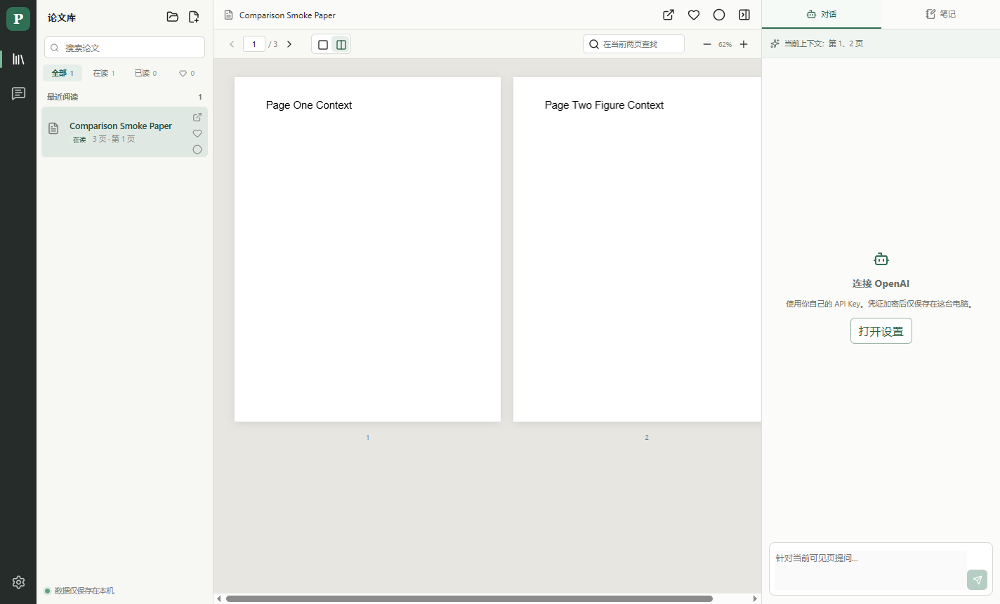

# PaperGT

本地优先的桌面论文阅读器：管理 PDF、保留阅读进度和笔记，并在需要时使用自己的 OpenAI API Key 提问。

[下载最新版](https://github.com/imnotjccc/PaperGT-Releases/releases/latest)

## 主要功能

- 打开本地 PDF 文件夹，使用三栏界面整理和阅读论文
- 在读、已读、收藏、阅读进度和按页笔记保存在本机
- 单页或双页显示，并可打开独立窗口对照另一篇 PDF
- 当前可见页搜索，以及使用自己的 OpenAI API Key 进行问答
- Windows Setup 安装版支持应用内更新

## 选择下载文件

| 平台 | 推荐文件 |
| --- | --- |
| Windows 10/11 x64 | `PaperGT-Setup-*-Windows-x64.exe` |
| macOS Apple Silicon | `PaperGT-*-macOS-arm64.dmg` |
| macOS Intel | `PaperGT-*-macOS-x64.dmg` |
| Linux x64 | `PaperGT-*-Linux-x86_64.AppImage` 或 `.deb` |

Windows 长期使用推荐 `Setup` 版。Portable 版无需安装，但需要手动下载新版本。

> v0.x 尚未购买商业代码签名证书，Windows SmartScreen 或 macOS Gatekeeper 可能显示未知发布者。请只从本仓库的 Releases 下载。

论文、笔记、阅读状态和 API Key 均保存在用户自己的电脑上；应用更新不会删除这些数据。
