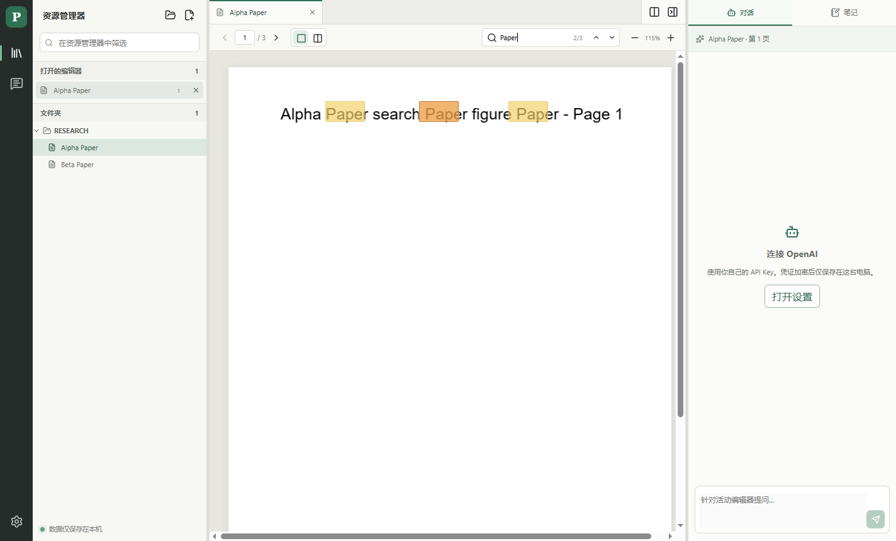

# PaperGT

本地优先的桌面论文阅读器：像 VS Code 一样管理 PDF 文件夹、阅读上下文和设置，需要时再使用自己的 OpenAI API Key 提问。

[下载最新版](https://github.com/imnotjccc/PaperGT-Releases/releases/latest)

## 主要功能

- 打开本地 PDF 文件夹，在资源管理器中按原目录层级浏览论文
- 每个编辑器组支持多个论文标签，可分别切换、关闭或拖到另一组
- 阅读页码和按页笔记自动保存在本机，不额外维护重复的阅读状态
- 单页或双页显示；将论文拖到主区域左右两侧可在同一窗口分屏对照
- 将分屏标签拖回另一组即可合并，空分屏会自动收起
- 拖动分隔线调整资源管理器、两个 PDF 编辑器与 AI / 笔记侧栏宽度
- Ctrl+F 查找当前可见页，在 PDF 原文高亮并逐处浏览匹配
- 设置作为编辑器标签打开，集中展示工作区、OpenAI、更新和快捷键
- 使用自己的 OpenAI API Key 针对当前可见页提问
- Windows Setup 安装版支持应用内更新

## 选择下载文件

| 平台 | 推荐文件 |
| --- | --- |
| Windows 10/11 x64 | `PaperGT-Setup-*-Windows-x64.exe` |
| macOS Apple Silicon | `PaperGT-*-macOS-arm64.dmg` |
| macOS Intel | `PaperGT-*-macOS-x64.dmg` |
| Linux x64 | `PaperGT-*-Linux-x86_64.AppImage` 或 `.deb` |

Windows 长期使用推荐 `Setup` 版。Portable 版无需安装，但需要手动下载新版本。

> v0.x 尚未购买商业代码签名证书，Windows SmartScreen 或 macOS Gatekeeper 可能显示未知发布者。请只从本仓库的 Releases 下载。

论文、阅读页码、笔记和 API Key 均保存在用户自己的电脑上；应用更新不会删除这些数据。
